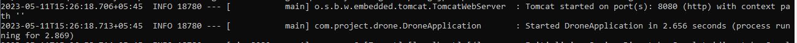
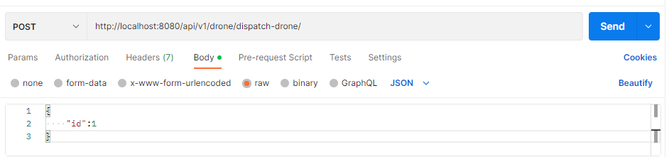

<h2>The Drone V1</h2>


<h3>**How to Run**</h3>


This application is packaged as a jar which has [Apache Tomcat/10.1.8] embedded. No Tomcat or JBoss installation is necessary. You run it using the `java -jar` command.


* Clone this repository
* Make sure you are using JDK 17 and Maven 3.x
* You can build the project and run the tests by running `mvn clean package`
* Once successfully built, you can run the service by one of these two methods:


```
       java -jar target/drone-0.0.1-SNAPSHOT.jar
or
        mvn spring-boot:run 
```


Once the application runs you should see something like this





<h3>**About The Service**</h3>


This service is about “**The Drone**” REST service. It uses an in-memory database (H2) to store the data. You can call the REST endpoints defined in com.project.drone.controllers.DispatchController on port **8080. **

**Endpoints are described below**

**	**You can use **Postman **to test all endpoint or use **curl **as shown given below:** **


1. **Dispatch Drone**

    It accepts medication id and searches for the best drone from the available list which are ready for loading. Medication is dispatched automatically to the selected drone.


**<span style="text-decoration:underline;">Request Url:</span>**


    **curl -H 'Content-Type: application/json' -d '{ "id": 1}' -X POST http://localhost:8080/api/v1/drone/dispatch-drone/**

**OR **





2. **Get Drone list available to load**

    It accepts medication id and lists all the drones available for loading in ascending order. Drone listed in top has more medications loaded.


**Request URL:**

**curl -H 'Content-Type: application/json'  -X GET http://localhost:8080/api/v1/drone/available-to-load/3 **


    OR


    


3. **Get medications loaded in Drone**

    It lists all medications loaded in the given drone. 


 **   Request Url:**

**curl -H 'Content-Type: application/json'  -X GET http://localhost:8080/api/v1/drone/check-medications/4**

OR 


4. **Get Drone Status**

    It sends all the information of drone including its battery level


**Request Url:**

**curl -H 'Content-Type: application/json'  -X GET http://localhost:8080/api/v1/drone/status/1**

OR


5. **Drone Event Log**

    We assume that the endpoint is hit by drone which sends their status and is recorded to the database in server and also updates battery level in drone table.


    **Request Url: **

**curl -H 'Content-Type: application/json' -d '{ "id": 4,"serialNumber":"DRN572462506328","model":"lightweight","weightLimit":400,"batteryCapacity":60,"droneState":"LOADING"}' -X POST http://localhost:8080/api/v1/drone/event-log**

OR


